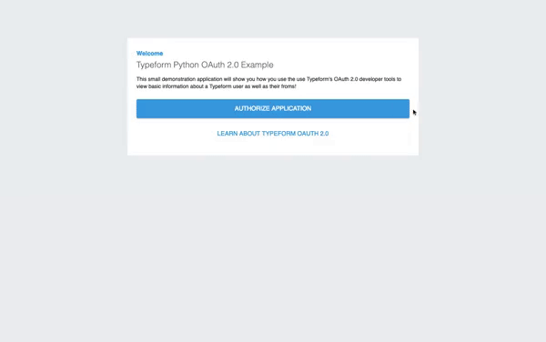
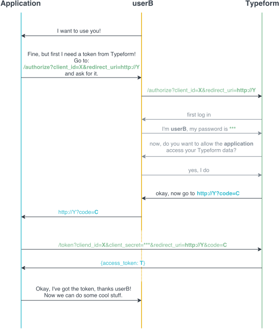

# Typeform Python OAuth 2.0 Example

OAuth is an open standard to access users information on other websites (LIKE TYPEFORM) but without giving them the passwords.

## Table of Contents

* [The OAuth App](#the-oauth-app)
* [Set Up](#set-up)
  * [Typeform](#typeform)
  * [Google Cloud](#google-cloud)
  * [One last thing](#one-last-thing)

## The OAuth App

The sample application requests a user for permission to read information about the user as well as the forms that they have from Typeform.

You can view a [live sample here](https://us-central1-typeform-python-examples.cloudfunctions.net/oauth2).



## Set Up

### Typeform

You need to register your application in your Typeform account for it work with the Typeform OAuth 2.0 mechanism. When you register your app, you'll receive the `client_id` and `client_secret` for your application, which are used during the OAuth 2.0 process to generate an access token. Here's a diagram of Typeform's OAuth 2.0 flow to illustrate how it works:



#### Create an application in the Typeform admin panel

1. Log in to your account at [Typeform](https://www.typeform.com/).
2. In the upper-right corner, in the drop-down menu next to your profile photo, click "My Account".
3. In the left menu, click "Developer Apps".
4. Click "Register a new app".
5. In the "App Name" field, type the name for your new app.
6. In the "App website" field, type the complete URL for your app's homepage. You may not have this yet, just make up something for now.
7. In the Redirect URI(s) field, type the complete callback URL for your app. We definitely DON'T have this yet, make up something.
8. Click "Register app".

After you save your app, the app's `client_secret` will be shown only once. Make sure you copy it and store it somewhere safe.

After that, you'll be able to see the `client_id` in the Developer Apps panel.

### Google Cloud

To host our Python OAuth example we will use Google Cloud Functions.

If you do not have a Google Cloud project you will need to create new project at the [Google Cloud Console](https://console.cloud.google.com). You will also need to enable billing for this project, so [check out this guide](https://cloud.google.com/billing/docs/how-to/modify-project) to set that up.

Finally you will need to [install the Google Cloud SDK](https://cloud.google.com/sdk/docs/quickstarts).

Now inside of the project folder run the `init` command:

```Bash
gcloud init
```

Connect the project with the correct Google Account as well as Google Cloud project.

Our demo requires a few environment variables to run. Rename the `.env.sample.yaml` file to `.env.yaml`. This file will store our environment variables for deployment.

> ## **DO NOT COMMIT `.env.yaml`**

Swap the placeholders with the required fields:

```yaml
GCPPROJECTID: <Put the ID of your GCP project here>
TFCLIENT: <Put the Client ID of your Typeform app here>
TFSECRET: <Put the Client Secret of your Typeform app here>
```

Now we just need to deploy our function:

```Bash
gcloud functions deploy oauth2 --runtime python37 --trigger-http --env-vars-file .env.yaml
```

This may take a few minutes, on completeion pay attention to the console. On success you should see something like this:

```Bash
availableMemoryMb: 256
entryPoint: oauth2
httpsTrigger:
  url: https://us-central1-typeform-python-examples.cloudfunctions.net/oauth2
labels:
  deployment-tool: cli-gcloud
name: projects/typeform-python-examples/locations/us-central1/functions/oauth2
runtime: python37
```

Be sure to copy the `url` in the `httpsTrigger`, we will need it. Visit it to test and see if it gives you a [page similar to this one](https://us-central1-typeform-python-examples.cloudfunctions.net/oauth2) (without the existing messages).

### One last thing

With the endpoint URL in hand, we can now properly [set up our app](#create-an-application-in-the-typeform-admin-panel).

1. Log in to your account at [Typeform](https://www.typeform.com/).
2. In the upper-right corner, in the drop-down menu next to your profile photo, click "My Account".
3. In the left menu, click "Developer Apps".
4. Click "Edit app" of the Typeform application you created earlier.
5. In the "App website" field paste the URL of our deployed function.
6. In the Redirect URI(s) field paste the URL of our deployed function.
7. Click "Update app".

And that's it, you're all set. Visit your enpoint URL and click "AUTHORIZE APPLICATION". If you select "Accept" on the Typeform authorization page you will be redirected to the previous page with a code that our function will use to get a proper token and get your form data to display.
