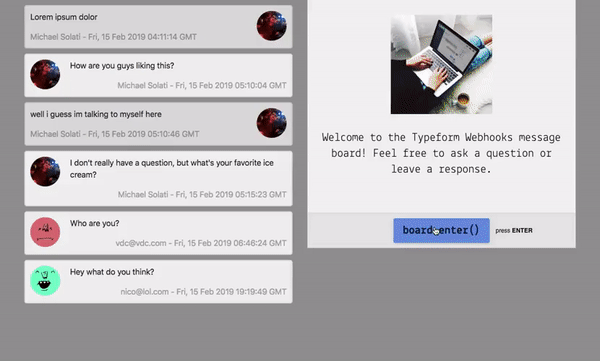
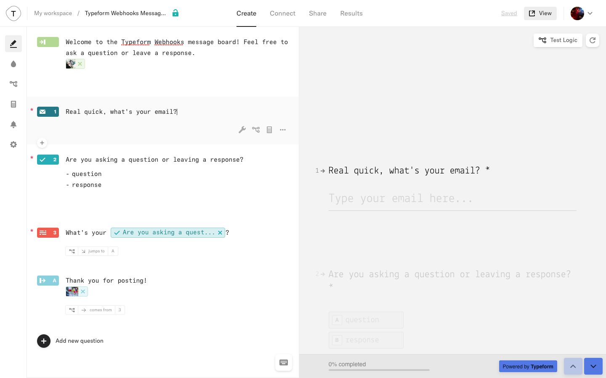

# Typeform Python Webhooks Example

Whenever you have a user fill out your form you can immediateley be notified and act upon the submission via webhooks! So what are webhooks? Simple... A webhook is an HTTP callback, a POST request, that is triggered by an event (like a form submission).

Think of it as our promise to you that we will send your endpoint a POST request whenever someone fills out your form!

## Table of Contents

* [The Message Board](#the-message-board)
* [Set Up](#set-up)
  * [Typeform](#typeform)
  * [Firebase](#firebase)
  * [Google Cloud](#google-cloud)
  * [One last thing](#one-last-thing)

## The Message Board

The sample application here is just a basic message board. When an user fills out the form Typeform send a POST request to our cloud function which will parse the data and save it into a Firebase Realtime Database (RTDB).

If you happen to make a GET request to the same endpoint you'll be greated with a message board page where you can fill out the Typeform and see other people's responses.

You can view a [live sample here](https://us-central1-typeform-python-examples.cloudfunctions.net/webhooksMessageBoard).



## Set Up

### Typeform

The (Type)form for this project only requires three blocks: an "Email" block, a "Multiple Choice" block, and a "Long Text" block (preferably in that order). Access your [Typeform workspace](http://admin.typeform.com/login) in order to create a form that asks for these three bits.

The questions we ask (which are all required) are:

* Email address (Email block)
* If it's a question or a response (Multiple Choice block)
* The content of the post (Long Text block)



After your form is created, click on the "Share" tab and copy your form URL. Then in the `main.py` change the `formURL` on line 8 to your forms share URL.

```Python
# Variables, feel free to change them
formURL = '<Your form URL here>'
```

### Firebase

This application uses the [Firebase RTDB](https://firebase.google.com/docs/database/) to store parsed webhook data. To get started, visit the [Firebase Console](https://console.firebase.google.com/) and create a new project.

While you don't need to set your billing plan to [Blaze](https://firebase.google.com/pricing/), it is recommended so that we can make HTTP requests outside of the Google ecosystem (this is necessary to get user details from Gravatar). It typically costs nothing for you to do, as you likely will not have crazy traffic, but it's your decision. If you do choose not to enable Blaze, you'll want to modify the code in `main.py` starting at line 74. Change this:

```Python
  # Get name and picture from Gravatar
  gravatar = requests.request('GET', 'https://www.gravatar.com/%s.json' % hashlib.md5(payload['email'].encode('utf-8')).hexdigest())
  if gravatar.status_code != 404:
    gravatarData = json.loads(gravatar.text)['entry'][0]
    payload['displayName'] = gravatarData['displayName']
    payload['thumbnailUrl'] = gravatarData['thumbnailUrl']
  else:
    payload['displayName'] = payload['email']
    payload['thumbnailUrl'] = 'https://api.adorable.io/avatars/285/%s.png' % payload['email']
```

To this:

```Python
  payload['displayName'] = payload['email']
  payload['thumbnailUrl'] = 'https://api.adorable.io/avatars/285/%s.png' % payload['email']
```

Select "Database" from the "Develop" section of the sidebar and scroll down to enable a "Realtime Database". Once your RTDB has been provisioned, click the "Rules" tab and set your rules to the following:

```JSON
{
  "rules": {
    ".read": "false",
    ".write": "false",
    "webhooks": {
      "message-board": {
        ".read": "true",
        ".write": "true"
      }
    }
  }
}
```

While this doesn't offer amazing sercurity, it should be sufficient for this demo.

Finally, in the sidebar, click the gear icon and then select "Project Settings". In the "Your apps" select the web app option (looks like `</>`) and copy the config into the `main.py` file, line 9, the `firebaseConfig`.

```Python
# Variables, feel free to change them
formURL = '<Your form URL here>'
firebaseConfig = {...} # Your Firebase config here
```

### Google Cloud

While Firebase Cloud Functions doesn't support Python at this time, Google Cloud Functions do! To set this up you will need to [install the Google Cloud SDK](https://cloud.google.com/sdk/docs/quickstarts).

Now inside of the project folder run the `init` command:

```Bash
gcloud init
```

Connect the project with the correct Google Account as well as Google Cloud project (this is the same as your Firebase project).

Now we just need to deploy our function:

```Bash
gcloud beta functions deploy webhooksMessageBoard --runtime python37 --trigger-http
```

This may take a few minutes, on completeion pay attention to the console. On success you should see something like this:

```Bash
availableMemoryMb: 256
entryPoint: webhooksMessageBoard
httpsTrigger:
  url: https://us-central1-typeform-python-examples.cloudfunctions.net/webhooksMessageBoard
labels:
  deployment-tool: cli-gcloud
name: projects/typeform-python-examples/locations/us-central1/functions/webhooksMessageBoard
runtime: python37
```

Be sure to copy the `url` in the `httpsTrigger`, we will need it. Visit it to test and see if it gives you a [page similar to this one](https://us-central1-typeform-python-examples.cloudfunctions.net/webhooksMessageBoard) (without the existing messages).

### One last thing

With the endpoint URL in hand, visit your Typeform form again and go to the "Connect" tab. In "Connect" go to "WEBHOOKS" and paste your endpoint as the "Destination URL", then flick the switch next to the "Webhooks" title to enable webhooks.

And that's it, you're all set. Visit your enpoint URL and fill out the form. You should see your message populate almost immediateley after you submit.